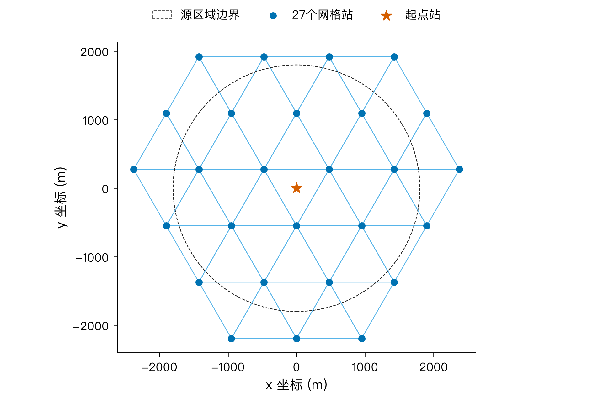
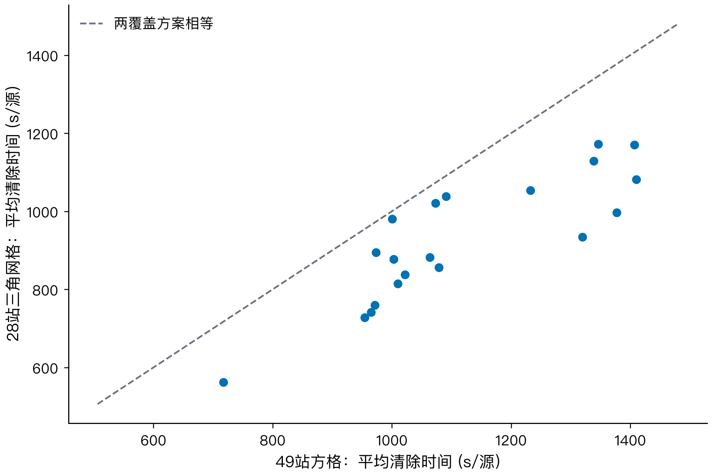
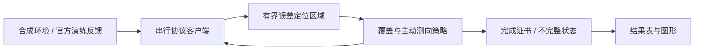

# CUMCM 2026 · B 题

**无线电干扰源的快速自动定位与清除**

从有界误差几何、主动测向到全域覆盖的可复现 Python 工程。

[快速理解](docs/overview.md) · [模型与证明](docs/model.md) · [实验结论](docs/results.md) · [q3 优化](docs/optimization.md) · [复现指南](docs/reproduction.md) · [Windows 演练](docs/simulator.md)

| 当前交付 | 已验证范围 |
| :--- | :--- |
| 本地合成实验 | 106 个独立运行，全部清除完成 |
| 官方演练 | 历史 7 局；新增 q3 策略组 25 局完整记录，另有 3 局缺少汇总 |
| 问题 4 覆盖改进 | 49 站 → 26 站；50 个配对合成场景中联合巡回平均降低 **19.40%** |
| 正式测试与论文 | 尚无正式成绩；Overleaf 已同步一版可编译论文草稿，正式结果仍待替换 |

早期 20 局方格对比曾得到 17.11%；当前 50 局共同源配置的 `q4_joint` 对新三角基线降低 19.40%。两者都是本地合成结果；官方演练批次使用不同隐藏场景，客户端未通过 API 验证演练模式，也不能据此推算官方提升比例或奖项水平。[统计口径与限制](docs/results.md)

<table>
<tr>
<td width="50%"></td>
<td width="50%"></td>
</tr>
<tr><td align="center">覆盖构造及几何保证</td><td align="center">固定场景的配对比较</td></tr>
</table>

## 快速开始

使用 Python 3.12，在仓库根目录执行：

```bash
python -m venv .venv
source .venv/bin/activate
python -m pip install -e ".[research,dev]"
python -m pytest
cumcm-b-benchmark --smoke
```

Windows PowerShell 将激活命令换成 `.\.venv\Scripts\Activate.ps1`。也可以始终使用虚拟环境内的 `python`，无需激活。

烟雾测试在 `.local/benchmarks/` 生成两局合成结果。完整复现 106 局、14 张图及校验清单：

```bash
python scripts/setup_quality_tools.py
python scripts/reproduce.py
```

复现只连接本地合成环境。绘图与质量检查使用固定版本的数学建模 skill 工具；下载地址与 SHA-256 见 [工具锁文件](tools/quality-tools.lock.json)。[依赖、字体与独立输出目录](docs/reproduction.md)

## 方案

当前 q3 入口使用 `adaptive_q10_dynamic`：首次主动点优先控制移动，后续测量再追求 q10 信息增益；该选择来自 50 个共同源配置的本地配对实验。当前 q4 入口使用 `q4_joint`：26 站闭集覆盖、固定开路径、途中测向和近目标提前定位。选择依据见 [q3 优化记录](docs/optimization.md) 和 [q4 优化记录](docs/q4_optimization.md)。

| 问题 | 方法 | 关键结论 |
| :--- | :--- | :--- |
| 1 · 定位区域 | 半平面交、旋转卡壳、最小包围圆 | 区域直径 ≤ 40 m 不足以保证一次清除 |
| 2 · 再次测向 | 距离可接收区、有限候选评分、精确后验核验 | 选点兼顾几何精度和移动距离，评分是启发式代理 |
| 3 · 全向源 | 七站全域覆盖、动态访问与清除 | 不依赖预先知道源总数的完成证书 |
| 4 · 定向源 | 26 站三角覆盖、联合巡回、光学格子兜底 | 995 m 单元覆盖任意闭半平面方向 |



## 论文与写作样本

论文源稿保存在 [`paper/`](paper/)；同一内容已同步到 Overleaf 项目“全国大学生数学建模竞赛编写的 LaTeX”，根文档为 `2026_new_main.tex`。论文明确区分本地合成实验、官方演练和正式测试待替换数据。国奖论文的结构、语言和论证样本见 [`docs/award_paper_writing_review.md`](docs/award_paper_writing_review.md)。

## 目录

```text
src/cumcm_b/         算法、协议、合成环境及命令行入口
tests/              几何、覆盖、协议与运行边界测试
scripts/            一键复现、绘图和 Windows 导出工具
docs/               题目解读、推导、结论、复现及演练说明
results/            合成实验、匿名演练汇总和验证记录
reports/figures/    SVG、300 dpi PNG、灰度预览与图表合同
requirements/       已验证的 Python 依赖快照
tools/              外部质量工具的版本与校验值
.github/workflows/  持续集成
.local/             本机历史归档、原始日志与临时结果（不入库）
```

核心实现从 [geometry.py](src/cumcm_b/geometry.py)、[policy.py](src/cumcm_b/policy.py)、[protocol.py](src/cumcm_b/protocol.py) 开始阅读。完整索引见 [docs/README.md](docs/README.md)，图表可查看 [本地画廊](reports/figures/图表面板.html) 或直接浏览 [figures 目录](reports/figures)。

## 使用边界

- 官方客户端在 Windows 内运行；先人工确认当前会话为**演练**，再传入 `--practice-ready`。该参数是人工确认，协议无法验证演练或正式模式。
- 原始题目、安装包、账号信息、逐动作记录与官方加密日志保留在本机；仓库仅含题目文件校验值及匿名统计。
- 所有成绩注明来源；有限测试不代表普遍成功率，覆盖保证仍受题设及时间预算约束。

[验证范围](docs/verification.md) · [整理迁移说明](docs/migration.md) · [工具来源与引用](docs/attribution.md)
